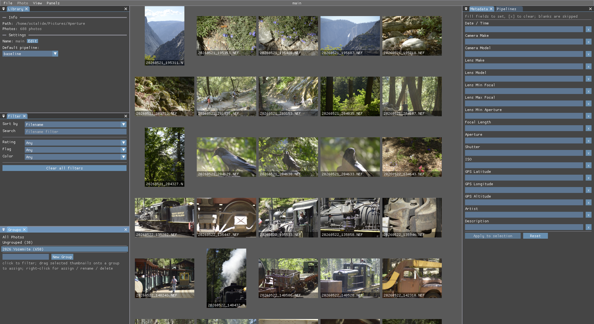
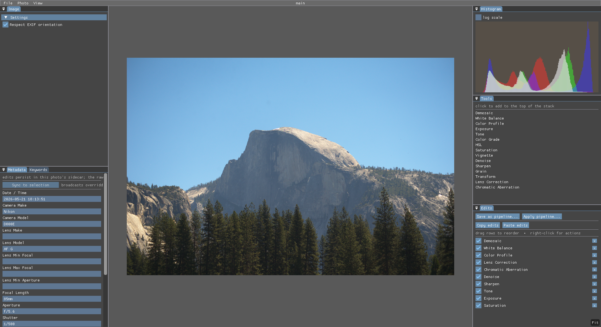

# aperture

Raw photo processor.

A focused, non-destructive editor for photographers whose workflow doesn't
fit the existing FOSS raw options. The scope is deliberately narrow:
library management, culling, grading, and export — done well. Feature
parity with darktable, RawTherapee, or commercial suites is explicitly
not the goal.

## Screenshots




## What it does

- Library management for raw photo banks
- Culling, rating, and grouping
- Non-destructive grading via reusable pipelines and per-photo edits
- Export to JPEG, TIFF, and PNG

## What it doesn't

- Pixel-level retouching (heal, clone, dodge, burn, frequency separation)
- Layers, compositing, complex masks
- Vector tools, text, drawing
- Stitching, panoramas, focus stacking
- Time-lapse, video
- Tethered shooting, print module
- Cloud sync, mobile or web apps
- Multi-user collaboration, catalogs spanning libraries

If you need any of the above, use a dedicated editor afterward —
aperture's job ends at "well-organized, exposure-and-color-correct,
exported."

## Install

### Linux

- **Flatpak** (recommended): download `aperture-X.Y.Z-x86_64.flatpak` from
  the latest [GitHub Release](https://github.com/octalium/aperture/releases),
  then:

  ```
  flatpak install --user ./aperture-X.Y.Z-x86_64.flatpak
  ```

  Flathub submission is tracked separately.
- **Build from source**: see the [Build from source](#build-from-source)
  section below.

### macOS

- **.dmg from Releases** (Apple Silicon only, macOS 11+): download from
  the latest [GitHub Release](https://github.com/octalium/aperture/releases)
  and drag `Aperture.app` to `/Applications`. First launch needs
  **right-click → Open** to bypass the Gatekeeper "unidentified developer"
  warning (the .dmg is unsigned — there is no Apple Developer ID
  notarization).
- **Build from source**: see [`pkg/macos/README.md`](pkg/macos/README.md).

### Windows

- **.msi from Releases** (x64, Windows 10 1809+): download
  `aperture-X.Y.Z-windows-x64.msi` from the latest
  [GitHub Release](https://github.com/octalium/aperture/releases) and
  double-click to install. Adds a **Start Menu → aperture** shortcut
  and an Add/Remove Programs entry; uninstall removes everything the
  installer placed. The .msi is unsigned, so SmartScreen shows an
  "unknown publisher" prompt on first run — click **More info → Run
  anyway**. A Vulkan-capable GPU + current driver is the only system
  requirement; `vulkan-1.dll` ships with every modern GPU driver.
- **Build from source**: see [`pkg/windows/README.md`](pkg/windows/README.md).

Library and config live under `%APPDATA%\aperture`.

## Build from source

aperture is C + Vulkan + Dear ImGui, built with [Meson](https://mesonbuild.com/)
and [Ninja](https://ninja-build.org/). The `meson install` target lays
down a desktop entry, hicolor icon, AppStream metainfo, and MIME
associations for the raw formats it reads (CR2, CR3, NEF, ARW, RAF, DNG,
ORF, RW2, PEF, SRW).

### Linux

System packages provide the dependencies pulled in via `pkg-config`. The
rest (lcms2, libpng, libtiff, cimgui, tomlc99, blake3, cJSON,
nativefiledialog) are vendored as meson wraps and built from source.

**Debian / Ubuntu**

```
sudo apt install build-essential meson ninja-build pkg-config \
    glslc libvulkan-dev vulkan-validationlayers libglfw3-dev \
    libraw-dev liblensfun-dev libsqlite3-dev libjpeg-dev \
    libtiff-dev libpng-dev libcurl4-openssl-dev \
    desktop-file-utils shared-mime-info appstream
```

**Fedora**

```
sudo dnf install gcc gcc-c++ meson ninja-build pkgconf-pkg-config \
    glslc vulkan-headers vulkan-loader-devel vulkan-validation-layers \
    glfw-devel LibRaw-devel lensfun-devel sqlite-devel \
    libjpeg-turbo-devel libtiff-devel libpng-devel libcurl-devel \
    desktop-file-utils shared-mime-info appstream
```

**Arch**

```
sudo pacman -S base-devel meson ninja pkgconf shaderc vulkan-headers \
    vulkan-icd-loader vulkan-validation-layers glfw libraw lensfun \
    sqlite libjpeg-turbo libtiff libpng curl desktop-file-utils \
    shared-mime-info appstream
```

Build and install:

```bash
make build
sudo make install                       # /usr/local
# or, no root needed:
PREFIX="$HOME/.local" make install
```

When installing under `$HOME/.local`, make sure `$HOME/.local/bin` is on
`PATH` and `$HOME/.local/share` is in `XDG_DATA_DIRS` so the desktop
entry, icon, and MIME types are picked up.

### macOS

See [`pkg/macos/README.md`](pkg/macos/README.md).

### Windows

See [`pkg/windows/README.md`](pkg/windows/README.md). Native
MSVC + meson; vcpkg supplies lensfun, everything else builds from the
submoduled `dep/` tree.

### Cache refresh (system installs only)

A non-staged `meson install` runs these for you. For staged installs
(`DESTDIR=…`):

```
update-desktop-database "$PREFIX/share/applications"
gtk-update-icon-cache -qtf "$PREFIX/share/icons/hicolor"
update-mime-database "$PREFIX/share/mime"
```

### User data locations

- Library registry: `$XDG_DATA_HOME/aperture` (default `~/.local/share/aperture`)
- UI config (ImGui layout, prefs): `$XDG_CONFIG_HOME/aperture` (default `~/.config/aperture`)

## Contributing

See [CONTRIBUTING.md](CONTRIBUTING.md).

## License

[MIT](LICENSE).
